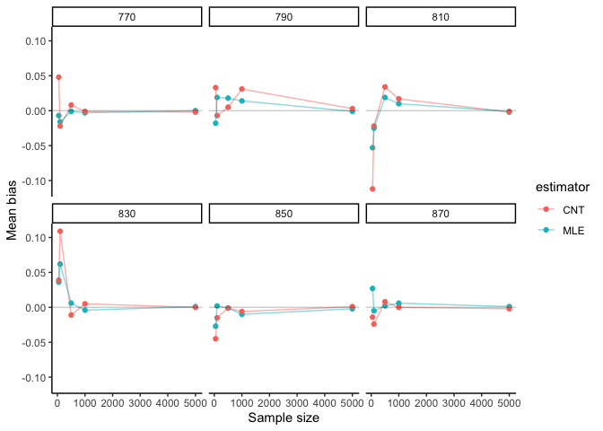
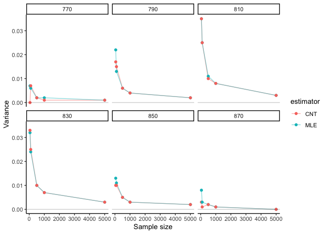

BST222 Project
================
Yunyang Zhong, Tianxiu Li(Katherine), Linfeng Hu

## Simulation

``` r
set.seed(222)
library(data.table)
library(dplyr)
results <- rbindlist(lapply(c(50, 100, 500, 1000, 5000), function(n){
  rbindlist(lapply(c(770, 790, 810, 830, 850, 870), function(param){
    x_pois <- round(rpois(n, param))
    
    #calculate lambda hat
    MLE_pois <- sum(x_pois)/n
    
    #calculate true probability at cutoff
    trueProb <- ppois(816, param)
    
    par_MLE <- ppois(816, MLE_pois)
    par_CNT <- mean(x_pois <= 816)
    
    #calculate asymptotic variance 
    v_MLE <- par_MLE*(1-par_MLE)/sqrt(n)
    v_CNT <- par_CNT*(1-par_CNT)/sqrt(n)
    
    #calculate MSE
    MSE_MLE <- mean((par_MLE - trueProb)^2)
    MSE_CNT <- mean((par_CNT - trueProb)^2)
    
    # Return estimates in data table
    data.table(n = c(n, n),
               estimator = factor(c("MLE", "CNT")),
               param_mu = c(param, param),
               trueProb = c(trueProb, trueProb), 
               #estimate = c(MLE_pois, CNT),
               #variances = c(var_pois, var_norm),
               prob = c(par_MLE, par_CNT),
               asymptotic_var = c(v_MLE, v_CNT),
               MSE = c(MSE_MLE, MSE_CNT)
               )
  }))
  }))
options(scipen = 999)
results <- results %>%
  mutate_if(is.numeric, round, digits=3)
results
```

    ##        n estimator param_mu trueProb  prob asymptotic_var   MSE
    ##  1:   50       MLE      770    0.952 0.945          0.007 0.000
    ##  2:   50       CNT      770    0.952 1.000          0.000 0.002
    ##  3:   50       MLE      790    0.827 0.809          0.022 0.000
    ##  4:   50       CNT      790    0.827 0.860          0.017 0.001
    ##  5:   50       MLE      810    0.592 0.539          0.035 0.003
    ##  6:   50       CNT      810    0.592 0.480          0.035 0.013
    ##  7:   50       MLE      830    0.321 0.357          0.032 0.001
    ##  8:   50       CNT      830    0.321 0.360          0.033 0.001
    ##  9:   50       MLE      850    0.125 0.098          0.013 0.001
    ## 10:   50       CNT      850    0.125 0.080          0.010 0.002
    ## 11:   50       MLE      870    0.034 0.061          0.008 0.001
    ## 12:   50       CNT      870    0.034 0.020          0.003 0.000
    ## 13:  100       MLE      770    0.952 0.936          0.006 0.000
    ## 14:  100       CNT      770    0.952 0.930          0.007 0.000
    ## 15:  100       MLE      790    0.827 0.846          0.013 0.000
    ## 16:  100       CNT      790    0.827 0.820          0.015 0.000
    ## 17:  100       MLE      810    0.592 0.567          0.025 0.001
    ## 18:  100       CNT      810    0.592 0.570          0.025 0.001
    ## 19:  100       MLE      830    0.321 0.383          0.024 0.004
    ## 20:  100       CNT      830    0.321 0.430          0.025 0.012
    ## 21:  100       MLE      850    0.125 0.127          0.011 0.000
    ## 22:  100       CNT      850    0.125 0.110          0.010 0.000
    ## 23:  100       MLE      870    0.034 0.029          0.003 0.000
    ## 24:  100       CNT      870    0.034 0.010          0.001 0.001
    ## 25:  500       MLE      770    0.952 0.951          0.002 0.000
    ## 26:  500       CNT      770    0.952 0.960          0.002 0.000
    ## 27:  500       MLE      790    0.827 0.845          0.006 0.000
    ## 28:  500       CNT      790    0.827 0.832          0.006 0.000
    ## 29:  500       MLE      810    0.592 0.611          0.011 0.000
    ## 30:  500       CNT      810    0.592 0.626          0.010 0.001
    ## 31:  500       MLE      830    0.321 0.327          0.010 0.000
    ## 32:  500       CNT      830    0.321 0.310          0.010 0.000
    ## 33:  500       MLE      850    0.125 0.124          0.005 0.000
    ## 34:  500       CNT      850    0.125 0.124          0.005 0.000
    ## 35:  500       MLE      870    0.034 0.036          0.002 0.000
    ## 36:  500       CNT      870    0.034 0.042          0.002 0.000
    ## 37: 1000       MLE      770    0.952 0.949          0.002 0.000
    ## 38: 1000       CNT      770    0.952 0.951          0.001 0.000
    ## 39: 1000       MLE      790    0.827 0.841          0.004 0.000
    ## 40: 1000       CNT      790    0.827 0.858          0.004 0.001
    ## 41: 1000       MLE      810    0.592 0.602          0.008 0.000
    ## 42: 1000       CNT      810    0.592 0.609          0.008 0.000
    ## 43: 1000       MLE      830    0.321 0.317          0.007 0.000
    ## 44: 1000       CNT      830    0.321 0.326          0.007 0.000
    ## 45: 1000       MLE      850    0.125 0.115          0.003 0.000
    ## 46: 1000       CNT      850    0.125 0.119          0.003 0.000
    ## 47: 1000       MLE      870    0.034 0.040          0.001 0.000
    ## 48: 1000       CNT      870    0.034 0.034          0.001 0.000
    ## 49: 5000       MLE      770    0.952 0.952          0.001 0.000
    ## 50: 5000       CNT      770    0.952 0.950          0.001 0.000
    ## 51: 5000       MLE      790    0.827 0.826          0.002 0.000
    ## 52: 5000       CNT      790    0.827 0.830          0.002 0.000
    ## 53: 5000       MLE      810    0.592 0.591          0.003 0.000
    ## 54: 5000       CNT      810    0.592 0.590          0.003 0.000
    ## 55: 5000       MLE      830    0.321 0.322          0.003 0.000
    ## 56: 5000       CNT      830    0.321 0.321          0.003 0.000
    ## 57: 5000       MLE      850    0.125 0.123          0.002 0.000
    ## 58: 5000       CNT      850    0.125 0.126          0.002 0.000
    ## 59: 5000       MLE      870    0.034 0.035          0.000 0.000
    ## 60: 5000       CNT      870    0.034 0.032          0.000 0.000
    ##        n estimator param_mu trueProb  prob asymptotic_var   MSE

## Evaluation

#### Bias

``` r
# Get results from simulation
bias_sim = results[, .(mean_bias = mean(prob - trueProb)), by = c("n", "param_mu", "estimator")]
bias_sim
```

    ##        n param_mu estimator mean_bias
    ##  1:   50      770       MLE    -0.007
    ##  2:   50      770       CNT     0.048
    ##  3:   50      790       MLE    -0.018
    ##  4:   50      790       CNT     0.033
    ##  5:   50      810       MLE    -0.053
    ##  6:   50      810       CNT    -0.112
    ##  7:   50      830       MLE     0.036
    ##  8:   50      830       CNT     0.039
    ##  9:   50      850       MLE    -0.027
    ## 10:   50      850       CNT    -0.045
    ## 11:   50      870       MLE     0.027
    ## 12:   50      870       CNT    -0.014
    ## 13:  100      770       MLE    -0.016
    ## 14:  100      770       CNT    -0.022
    ## 15:  100      790       MLE     0.019
    ## 16:  100      790       CNT    -0.007
    ## 17:  100      810       MLE    -0.025
    ## 18:  100      810       CNT    -0.022
    ## 19:  100      830       MLE     0.062
    ## 20:  100      830       CNT     0.109
    ## 21:  100      850       MLE     0.002
    ## 22:  100      850       CNT    -0.015
    ## 23:  100      870       MLE    -0.005
    ## 24:  100      870       CNT    -0.024
    ## 25:  500      770       MLE    -0.001
    ## 26:  500      770       CNT     0.008
    ## 27:  500      790       MLE     0.018
    ## 28:  500      790       CNT     0.005
    ## 29:  500      810       MLE     0.019
    ## 30:  500      810       CNT     0.034
    ## 31:  500      830       MLE     0.006
    ## 32:  500      830       CNT    -0.011
    ## 33:  500      850       MLE    -0.001
    ## 34:  500      850       CNT    -0.001
    ## 35:  500      870       MLE     0.002
    ## 36:  500      870       CNT     0.008
    ## 37: 1000      770       MLE    -0.003
    ## 38: 1000      770       CNT    -0.001
    ## 39: 1000      790       MLE     0.014
    ## 40: 1000      790       CNT     0.031
    ## 41: 1000      810       MLE     0.010
    ## 42: 1000      810       CNT     0.017
    ## 43: 1000      830       MLE    -0.004
    ## 44: 1000      830       CNT     0.005
    ## 45: 1000      850       MLE    -0.010
    ## 46: 1000      850       CNT    -0.006
    ## 47: 1000      870       MLE     0.006
    ## 48: 1000      870       CNT     0.000
    ## 49: 5000      770       MLE     0.000
    ## 50: 5000      770       CNT    -0.002
    ## 51: 5000      790       MLE    -0.001
    ## 52: 5000      790       CNT     0.003
    ## 53: 5000      810       MLE    -0.001
    ## 54: 5000      810       CNT    -0.002
    ## 55: 5000      830       MLE     0.001
    ## 56: 5000      830       CNT     0.000
    ## 57: 5000      850       MLE    -0.002
    ## 58: 5000      850       CNT     0.001
    ## 59: 5000      870       MLE     0.001
    ## 60: 5000      870       CNT    -0.002
    ##        n param_mu estimator mean_bias

``` r
library(ggplot2)
library(dplyr)
# Plot of bias, facet by beta
bias_sim %>%
  ggplot(aes(x = n, y = mean_bias, color = estimator)) + 
  geom_point() + geom_line(alpha=0.5) +
  #geom_point(aes(shape = factor(param_mu))) +
  geom_abline(slope = 0, intercept = 0, alpha = 0.2) + 
  facet_wrap(~ param_mu) +
  #scale_shape_discrete("True value") +
  labs(x = "Sample size", y = "Mean bias") +
  theme_classic()
```

<!-- -->

#### MSE

``` r
mse_sim <- results[, .(mean_mse = mean((prob - trueProb)^2)), by = c("n", "param_mu", "estimator")]
mse_sim
```

    ##        n param_mu estimator mean_mse
    ##  1:   50      770       MLE 0.000049
    ##  2:   50      770       CNT 0.002304
    ##  3:   50      790       MLE 0.000324
    ##  4:   50      790       CNT 0.001089
    ##  5:   50      810       MLE 0.002809
    ##  6:   50      810       CNT 0.012544
    ##  7:   50      830       MLE 0.001296
    ##  8:   50      830       CNT 0.001521
    ##  9:   50      850       MLE 0.000729
    ## 10:   50      850       CNT 0.002025
    ## 11:   50      870       MLE 0.000729
    ## 12:   50      870       CNT 0.000196
    ## 13:  100      770       MLE 0.000256
    ## 14:  100      770       CNT 0.000484
    ## 15:  100      790       MLE 0.000361
    ## 16:  100      790       CNT 0.000049
    ## 17:  100      810       MLE 0.000625
    ## 18:  100      810       CNT 0.000484
    ## 19:  100      830       MLE 0.003844
    ## 20:  100      830       CNT 0.011881
    ## 21:  100      850       MLE 0.000004
    ## 22:  100      850       CNT 0.000225
    ## 23:  100      870       MLE 0.000025
    ## 24:  100      870       CNT 0.000576
    ## 25:  500      770       MLE 0.000001
    ## 26:  500      770       CNT 0.000064
    ## 27:  500      790       MLE 0.000324
    ## 28:  500      790       CNT 0.000025
    ## 29:  500      810       MLE 0.000361
    ## 30:  500      810       CNT 0.001156
    ## 31:  500      830       MLE 0.000036
    ## 32:  500      830       CNT 0.000121
    ## 33:  500      850       MLE 0.000001
    ## 34:  500      850       CNT 0.000001
    ## 35:  500      870       MLE 0.000004
    ## 36:  500      870       CNT 0.000064
    ## 37: 1000      770       MLE 0.000009
    ## 38: 1000      770       CNT 0.000001
    ## 39: 1000      790       MLE 0.000196
    ## 40: 1000      790       CNT 0.000961
    ## 41: 1000      810       MLE 0.000100
    ## 42: 1000      810       CNT 0.000289
    ## 43: 1000      830       MLE 0.000016
    ## 44: 1000      830       CNT 0.000025
    ## 45: 1000      850       MLE 0.000100
    ## 46: 1000      850       CNT 0.000036
    ## 47: 1000      870       MLE 0.000036
    ## 48: 1000      870       CNT 0.000000
    ## 49: 5000      770       MLE 0.000000
    ## 50: 5000      770       CNT 0.000004
    ## 51: 5000      790       MLE 0.000001
    ## 52: 5000      790       CNT 0.000009
    ## 53: 5000      810       MLE 0.000001
    ## 54: 5000      810       CNT 0.000004
    ## 55: 5000      830       MLE 0.000001
    ## 56: 5000      830       CNT 0.000000
    ## 57: 5000      850       MLE 0.000004
    ## 58: 5000      850       CNT 0.000001
    ## 59: 5000      870       MLE 0.000001
    ## 60: 5000      870       CNT 0.000004
    ##        n param_mu estimator mean_mse

``` r
# Plot of MSE, facet by beta
mse_sim %>%
  ggplot(aes(x = n, y = mean_mse, color = estimator)) +
  geom_point() + geom_line(alpha = 0.2) +
  scale_shape_discrete("True value") +
  geom_abline(slope = 0, intercept = 0, alpha = 0.1) +
  facet_wrap(~ param_mu) +
  labs(x = "Sample size", y = "Mean Squared Error") +
  theme_classic()
```

<!-- -->

#### Variance

``` r
estimator_var <- results[, .(var_est = asymptotic_var), 
                         by = c("n", "param_mu", "estimator")]
estimator_var
```

    ##        n param_mu estimator var_est
    ##  1:   50      770       MLE   0.007
    ##  2:   50      770       CNT   0.000
    ##  3:   50      790       MLE   0.022
    ##  4:   50      790       CNT   0.017
    ##  5:   50      810       MLE   0.035
    ##  6:   50      810       CNT   0.035
    ##  7:   50      830       MLE   0.032
    ##  8:   50      830       CNT   0.033
    ##  9:   50      850       MLE   0.013
    ## 10:   50      850       CNT   0.010
    ## 11:   50      870       MLE   0.008
    ## 12:   50      870       CNT   0.003
    ## 13:  100      770       MLE   0.006
    ## 14:  100      770       CNT   0.007
    ## 15:  100      790       MLE   0.013
    ## 16:  100      790       CNT   0.015
    ## 17:  100      810       MLE   0.025
    ## 18:  100      810       CNT   0.025
    ## 19:  100      830       MLE   0.024
    ## 20:  100      830       CNT   0.025
    ## 21:  100      850       MLE   0.011
    ## 22:  100      850       CNT   0.010
    ## 23:  100      870       MLE   0.003
    ## 24:  100      870       CNT   0.001
    ## 25:  500      770       MLE   0.002
    ## 26:  500      770       CNT   0.002
    ## 27:  500      790       MLE   0.006
    ## 28:  500      790       CNT   0.006
    ## 29:  500      810       MLE   0.011
    ## 30:  500      810       CNT   0.010
    ## 31:  500      830       MLE   0.010
    ## 32:  500      830       CNT   0.010
    ## 33:  500      850       MLE   0.005
    ## 34:  500      850       CNT   0.005
    ## 35:  500      870       MLE   0.002
    ## 36:  500      870       CNT   0.002
    ## 37: 1000      770       MLE   0.002
    ## 38: 1000      770       CNT   0.001
    ## 39: 1000      790       MLE   0.004
    ## 40: 1000      790       CNT   0.004
    ## 41: 1000      810       MLE   0.008
    ## 42: 1000      810       CNT   0.008
    ## 43: 1000      830       MLE   0.007
    ## 44: 1000      830       CNT   0.007
    ## 45: 1000      850       MLE   0.003
    ## 46: 1000      850       CNT   0.003
    ## 47: 1000      870       MLE   0.001
    ## 48: 1000      870       CNT   0.001
    ## 49: 5000      770       MLE   0.001
    ## 50: 5000      770       CNT   0.001
    ## 51: 5000      790       MLE   0.002
    ## 52: 5000      790       CNT   0.002
    ## 53: 5000      810       MLE   0.003
    ## 54: 5000      810       CNT   0.003
    ## 55: 5000      830       MLE   0.003
    ## 56: 5000      830       CNT   0.003
    ## 57: 5000      850       MLE   0.002
    ## 58: 5000      850       CNT   0.002
    ## 59: 5000      870       MLE   0.000
    ## 60: 5000      870       CNT   0.000
    ##        n param_mu estimator var_est

``` r
# Plot of variance (similar to MSE???)
estimator_var %>%
  ggplot(aes(x = n, y = var_est, color = estimator)) +
  geom_line(alpha = 0.5) +
  geom_point() + 
  geom_abline(slope = 0, intercept = 0, alpha = 0.2) +
  facet_wrap(~param_mu) +
  labs(x = "Sample size", y = "Variance") +
  theme_classic()
```

<!-- -->
