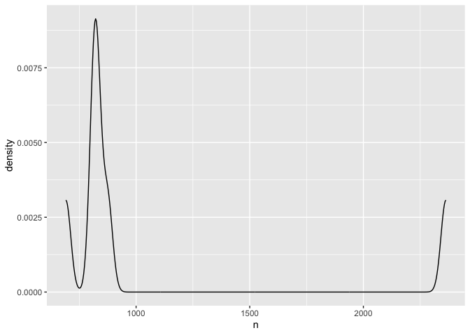
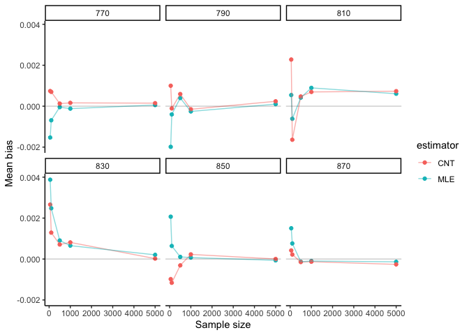
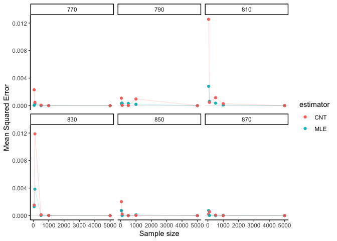
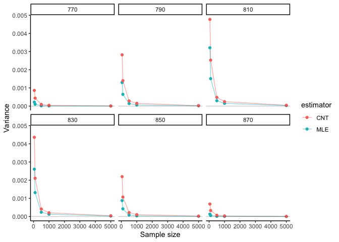

BST222 Project
================
Yunyang Zhong, Tianxiu Li(Katherine), Linfeng Hu

## Data Exploration

``` r
library(tidyverse)

data<-read.csv("us.csv")
```

``` r
data %>% 
  filter(State=="MA") %>% 
  mutate(Year=substring(Start_Time,1,4)) %>% 
  mutate(Month=substring(Start_Time, 6,7)) %>% 
  group_by(Year) %>% 
  count()
```

    ## # A tibble: 6 × 2
    ## # Groups:   Year [6]
    ##   Year      n
    ##   <chr> <int>
    ## 1 2016    820
    ## 2 2017    875
    ## 3 2018    827
    ## 4 2019    691
    ## 5 2020   2363
    ## 6 2021    816

``` r
data %>% 
  filter(State=="MA") %>% 
  mutate(Year=substring(Start_Time,1,4)) %>% 
  group_by(Year) %>% 
  count() %>% 
  ggplot(aes(x = n)) +
  geom_density()
```

<!-- -->

``` r
count <- c(820,875,827,691,2363,816)
mean(count)
```

    ## [1] 1065.333

``` r
sd(count)
```

    ## [1] 638.6626

``` r
count_1 <- c(820,875,827,691,816)
mean(count_1)
```

    ## [1] 805.8

``` r
sd(count_1)
```

    ## [1] 68.41564

## Simulation

``` r
set.seed(222)
library(data.table)
library(dplyr)
results <- rbindlist(lapply(c(50, 100, 500, 1000, 5000), function(n){
  rbindlist(lapply(c(770, 790, 810, 830, 850, 870), function(param){
    x_pois <- round(rpois(n, param))
    
    # calculate lambda hat
    MLE_pois <- sum(x_pois)/n
    
    # calculate true probability at cutoff
    trueProb <- ppois(816, param)
    
    par_MLE <- ppois(816, MLE_pois)
    par_CNT <- mean(x_pois <= 816)
    
    # calculate asymptotic variance 
    v_MLE <- par_MLE*(1-par_MLE)/sqrt(n)
    v_CNT <- par_CNT*(1-par_CNT)/sqrt(n)
    
    # calculate MSE
    MSE_MLE <- mean((par_MLE - trueProb)^2)
    MSE_CNT <- mean((par_CNT - trueProb)^2)
    
    # return estimates in data table
    data.table(n = c(n, n),
               estimator = factor(c("MLE", "CNT")),
               param_mu = c(param, param),
               trueProb = c(trueProb, trueProb), 
               #estimate = c(MLE_pois, CNT),
               #variances = c(var_pois, var_norm),
               prob = c(par_MLE, par_CNT),
               asymptotic_var = c(v_MLE, v_CNT),
               MSE = c(MSE_MLE, MSE_CNT)
               )
  }))
  }))
options(scipen = 999)
results <- results %>%
  mutate_if(is.numeric, round, digits=3)
head(results)
```

    ##     n estimator param_mu trueProb  prob asymptotic_var   MSE
    ## 1: 50       MLE      770    0.952 0.945          0.007 0.000
    ## 2: 50       CNT      770    0.952 1.000          0.000 0.002
    ## 3: 50       MLE      790    0.827 0.809          0.022 0.000
    ## 4: 50       CNT      790    0.827 0.860          0.017 0.001
    ## 5: 50       MLE      810    0.592 0.539          0.035 0.003
    ## 6: 50       CNT      810    0.592 0.480          0.035 0.013

## Evaluation

#### Bias

``` r
# Get results from simulation
bias_sim = results[, .(mean_bias = mean(prob - trueProb)), by = c("n", "param_mu", "estimator")]
head(bias_sim)
```

    ##     n param_mu estimator mean_bias
    ## 1: 50      770       MLE    -0.007
    ## 2: 50      770       CNT     0.048
    ## 3: 50      790       MLE    -0.018
    ## 4: 50      790       CNT     0.033
    ## 5: 50      810       MLE    -0.053
    ## 6: 50      810       CNT    -0.112

``` r
library(ggplot2)
library(dplyr)
# Plot of bias, facet by beta
bias_sim %>%
  ggplot(aes(x = n, y = mean_bias, color = estimator)) + 
  geom_point() + geom_line(alpha=0.5) +
  #geom_point(aes(shape = factor(param_mu))) +
  geom_abline(slope = 0, intercept = 0, alpha = 0.2) + 
  facet_wrap(~ param_mu) +
  labs(x = "Sample size", y = "Mean bias") +
  theme_classic()
```

<!-- -->

#### MSE

``` r
mse_sim <- results[, .(mean_mse = mean((prob - trueProb)^2)), by = c("n", "param_mu", "estimator")]
head(mse_sim)
```

    ##     n param_mu estimator mean_mse
    ## 1: 50      770       MLE 0.000049
    ## 2: 50      770       CNT 0.002304
    ## 3: 50      790       MLE 0.000324
    ## 4: 50      790       CNT 0.001089
    ## 5: 50      810       MLE 0.002809
    ## 6: 50      810       CNT 0.012544

``` r
# Plot of MSE, facet by beta
mse_sim %>%
  ggplot(aes(x = n, y = mean_mse, color = estimator)) +
  geom_point() + geom_line(alpha = 0.2) +
  scale_shape_discrete("True value") +
  geom_abline(slope = 0, intercept = 0, alpha = 0.1) +
  facet_wrap(~ param_mu) +
  labs(x = "Sample size", y = "Mean Squared Error") +
  theme_classic()
```

<!-- -->

#### Variance

``` r
estimator_var <- results[, .(var_est = asymptotic_var), 
                         by = c("n", "param_mu", "estimator")]
head(estimator_var)
```

    ##     n param_mu estimator var_est
    ## 1: 50      770       MLE   0.007
    ## 2: 50      770       CNT   0.000
    ## 3: 50      790       MLE   0.022
    ## 4: 50      790       CNT   0.017
    ## 5: 50      810       MLE   0.035
    ## 6: 50      810       CNT   0.035

``` r
# Plot of variance
estimator_var %>%
  ggplot(aes(x = n, y = var_est, color = estimator)) +
  geom_line(alpha = 0.5) +
  geom_point() + 
  geom_abline(slope = 0, intercept = 0, alpha = 0.2) +
  facet_wrap(~param_mu) +
  labs(x = "Sample size", y = "Variance") +
  theme_classic()
```

<!-- -->
