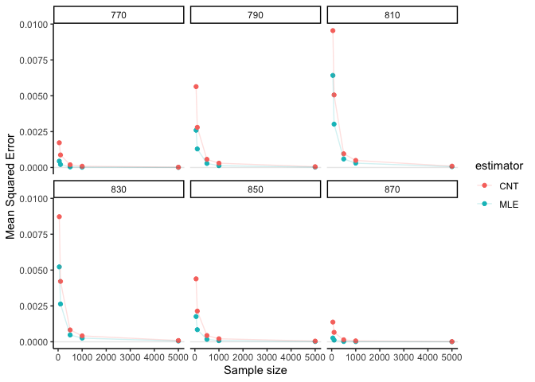

BST222 Project
================
Yunyang Zhong, Tianxiu Li(Katherine), Linfeng Hu

## Data Exploration

``` r
library(tidyverse)

data<-read.csv("us.csv")
```

``` r
data %>% 
  filter(State=="MA") %>% 
  mutate(Year=substring(Start_Time,1,4)) %>% 
  mutate(Month=substring(Start_Time, 6,7)) %>% 
  group_by(Year) %>% 
  count()
```

    ## # A tibble: 6 × 2
    ## # Groups:   Year [6]
    ##   Year      n
    ##   <chr> <int>
    ## 1 2016    820
    ## 2 2017    875
    ## 3 2018    827
    ## 4 2019    691
    ## 5 2020   2363
    ## 6 2021    816

``` r
data %>% 
  filter(State=="MA") %>% 
  mutate(Year=substring(Start_Time,1,4)) %>% 
  group_by(Year) %>% 
  count() %>% 
  ggplot(aes(x = n)) +
  geom_density()
```

<!-- -->

``` r
count <- c(820,875,827,691,2363,816)
mean(count)
```

    ## [1] 1065.333

``` r
sd(count)
```

    ## [1] 638.6626

``` r
count_1 <- c(820,875,827,691,816)
mean(count_1)
```

    ## [1] 805.8

``` r
sd(count_1)
```

    ## [1] 68.41564

## Simulation

``` r
set.seed(222)
library(data.table)
library(dplyr)
results <- rbindlist(lapply(1:1000, function(i){
  rbindlist(lapply(c(50, 100, 500, 1000, 5000), function(n){
  rbindlist(lapply(c(770, 790, 810, 830, 850, 870), function(param){
    x_pois <- round(rpois(n, param))
    
    # calculate lambda hat
    MLE_pois <- sum(x_pois)/n
    # calculate true probability at cutoff
    trueProb <- ppois(816, param)
    
    par_MLE <- ppois(816, MLE_pois)
    par_CNT <- sum(x_pois <= 816)/n
  
    
    # return estimates in data table
    data.table(n = c(n, n),
               estimator = factor(c("MLE", "CNT")),
               param_mu = c(param, param),
               trueProb = c(trueProb, trueProb), 
               prob = c(par_MLE, par_CNT)
               )
  }))
  }))
}))
options(scipen = 999)
results <- results %>%
  mutate_if(is.numeric, round, digits=3) %>%
  arrange(n, param_mu)
results
```

    ##           n estimator param_mu trueProb  prob
    ##     1:   50       MLE      770    0.952 0.945
    ##     2:   50       CNT      770    0.952 1.000
    ##     3:   50       MLE      770    0.952 0.974
    ##     4:   50       CNT      770    0.952 1.000
    ##     5:   50       MLE      770    0.952 0.946
    ##    ---                                       
    ## 59996: 5000       CNT      870    0.034 0.035
    ## 59997: 5000       MLE      870    0.034 0.034
    ## 59998: 5000       CNT      870    0.034 0.035
    ## 59999: 5000       MLE      870    0.034 0.032
    ## 60000: 5000       CNT      870    0.034 0.027

``` r
results|>filter(n==50,estimator=="MLE",param_mu==810)|>summarise(mean=mean(prob))
```

    ##       mean
    ## 1 0.592545

## Evaluation

#### Bias

``` r
# Get results from simulation
bias_sim = results[, .(mean_bias = mean(prob - trueProb)), by = c("n", "param_mu", "estimator")]
head(bias_sim)
```

    ##     n param_mu estimator mean_bias
    ## 1: 50      770       MLE -0.001531
    ## 2: 50      770       CNT  0.000740
    ## 3: 50      790       MLE -0.001987
    ## 4: 50      790       CNT  0.001000
    ## 5: 50      810       MLE  0.000545
    ## 6: 50      810       CNT  0.002280

``` r
library(ggplot2)
library(dplyr)
# Plot of bias, facet by lambda
bias_sim %>%
  ggplot(aes(x = n, y = mean_bias, color = estimator)) + 
  geom_point() + geom_line(alpha=0.5) +
  #geom_point(aes(shape = factor(param_mu))) +
  geom_abline(slope = 0, intercept = 0, alpha = 0.2) + 
  facet_wrap(~ param_mu) +
  labs(x = "Sample size", y = "Mean bias") +
  theme_classic()
```

<!-- -->

#### MSE

``` r
mse_sim <- results[, .(mean_mse = mean(var(prob)+ (prob - trueProb)^2)), by = c("n", "param_mu", "estimator")]
head(mse_sim)
```

    ##     n param_mu estimator    mean_mse
    ## 1: 50      770       MLE 0.000441994
    ## 2: 50      770       CNT 0.001725595
    ## 3: 50      790       MLE 0.002596315
    ## 4: 50      790       CNT 0.005639020
    ## 5: 50      810       MLE 0.006419556
    ## 6: 50      810       CNT 0.009544534

``` r
# Plot of MSE, facet by lambda
mse_sim %>%
  ggplot(aes(x = n, y = mean_mse, color = estimator)) +
  geom_point() + geom_line(alpha = 0.2) +
  scale_shape_discrete("True value") +
  geom_abline(slope = 0, intercept = 0, alpha = 0.1) +
  facet_wrap(~ param_mu) +
  labs(x = "Sample size", y = "Mean Squared Error") +
  theme_classic()
```

<!-- -->

#### Variance

``` r
estimator_var <- results[, .(var_est = mean(var(prob))), 
                         by = c("n", "param_mu", "estimator")]
head(estimator_var)
```

    ##     n param_mu estimator      var_est
    ## 1: 50      770       MLE 0.0002199350
    ## 2: 50      770       CNT 0.0008629554
    ## 3: 50      790       MLE 0.0012968317
    ## 4: 50      790       CNT 0.0028204204
    ## 5: 50      810       MLE 0.0032112352
    ## 6: 50      810       CNT 0.0047720537

``` r
# Plot of variance
estimator_var %>%
  ggplot(aes(x = n, y = var_est, color = estimator)) +
  geom_line(alpha = 0.5) +
  geom_point() + 
  geom_abline(slope = 0, intercept = 0, alpha = 0.2) +
  facet_wrap(~param_mu) +
  labs(x = "Sample size", y = "Variance") +
  theme_classic()
```

<!-- -->
